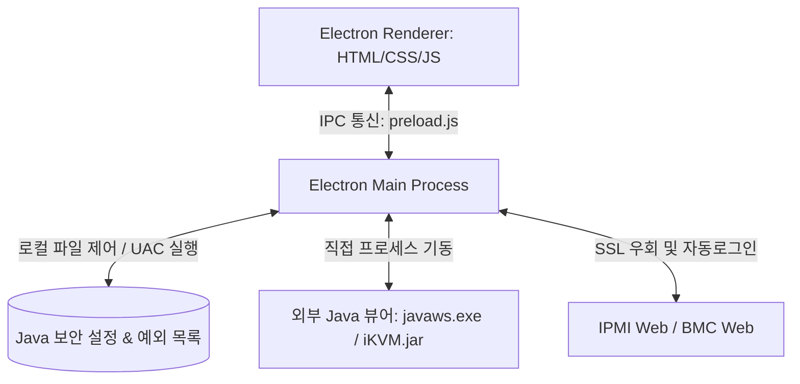

# ☕ IPMI Manager Node.js (Electron) 버전 기술 명세 및 벤더별 연동 가이드

본 문서는 **IPMI Manager**의 Node.js/Electron 기반 GUI 클라이언트 버전에 대한 기술적 구현 세부사항과, 백테스트 결과를 바탕으로 한 각 서버 제조사(벤더)별 IPMI/KVM 연동 및 우회 처리 매커니즘을 상세히 기록한 문서입니다.

---

## 1. Node.js (Electron) 버전 아키텍처 개요

Electron 버전은 사용자 편의성을 극대화한 데스크탑 애플리케이션으로, 복잡한 Java 보안 설정과 구형 브라우저에서 접속이 불가능한 자체 서명 SSL 인증서 문제를 크롬(Chromium) 엔진 커스터마이징 및 Node.js 네이티브 API를 활용하여 해결합니다.



### 핵심 모듈 구성
*   `main.js`: Electron 메인 프로세스로, Chromium 브라우저의 SSL/TLS 수준을 낮추고, IPC(Inter-Process Communication) 이벤트를 수신하여 로컬 파일(Java 예외 사이트 목록 등) 수정 및 외부 프로세스(`javaws.exe`, `iKVM.jar`) 구동을 대행합니다.
*   `preload.js`: 렌더러와 메인 프로세스 간의 안전한 브릿지 역할을 하며, 메인 프로세스의 기능을 프론트엔드 JavaScript API로 바인딩합니다.
*   `login-preload.js`: IPMI 웹 로그인 페이지 로딩 시 주입되는 전용 스크립트로, 벤더별 로그인 폼 요소를 동적으로 탐색하여 자동 로그인을 수행하고 특정 벤더의 로그인 루프 버그를 방어합니다.
*   `renderer/app.js`: 프론트엔드 UI 이벤트 처리 및 상태 관리를 담당합니다.
*   `vendors/java-manager.js`: 로컬 시스템의 Java JRE 버전을 자동 탐지하고, 만료된 SSL 검사 무시 및 TLS 1.0/1.1 강제 허용 등의 보안 패치를 적용합니다.

---

## 2. 주요 기능별 우회 구현 원리

### ① SSL/TLS 보안 완화 및 구형 암호화 스위트 허용
구형 iDRAC 6/7 등은 현대 웹 브라우저에서 퇴출된 3DES, RC4 암호화 알고리즘이나 TLS 1.0/1.1 버전을 사용하기 때문에 일반 크롬 브라우저에서는 `ERR_SSL_VERSION_OR_CIPHER_MISMATCH` 에러와 함께 접속이 원천 차단됩니다.
*   **구현 방식**: Electron 메인 프로세스 기동 시, Chromium 커맨드라인 스위치 설정을 통해 SSL 최저 요구 수준을 완화합니다.
    ```javascript
    // main.js 예시
    app.commandLine.appendSwitch('ignore-certificate-errors', 'true');
    app.commandLine.appendSwitch('ssl-version-min', 'tls1');
    app.commandLine.appendSwitch('cipher-suite-blacklist', ''); // 블랙리스트 초기화로 레거시 암호화 허용
    ```
*   **HTTP 자동 폴백 (Fallback)**: 그럼에도 불구하고 SSL 협상에 완전히 실패할 경우, 렌더러가 감지하여 `http://` 프로토콜로 자동 리다이렉션함으로써 무중단 접속 흐름을 보장합니다.

### ② Java 보안 차단 해제 및 예외 목록 자동 등록
Java Web Start(`javaws.exe`) 실행 시, 오프라인 장비나 자체 서명 인증서를 사용하는 장비는 보안 경고 창이 발생하거나 기동이 차단됩니다.
*   **구현 방식**:
    1.  사용자가 KVM 접속 버튼을 누르는 즉시, 해당 장비의 IP/도메인을 윈도우 사용자 프로필 아래의 Java 예외 사이트 파일(`%USERPROFILE%\AppData\LocalLow\Sun\Java\Deployment\security\exception.sites`)에 자동으로 추가합니다.
    2.  `deployment.properties` 파일을 직접 수정하여 다음 설정을 강제 주입합니다.
        *   `deployment.security.level=HIGH` (최상위 VERY_HIGH 차단 완화)
        *   `deployment.security.revocation.check=NO_CHECK` (인증서 해지 여부 검사 생략 - 경고창 소멸 핵심)
        *   `deployment.security.TLSv1.0=true` / `deployment.security.TLSv1.1=true` (구형 TLS 활성화)
    3.  이를 통해 UAC(사용자 계정 컨트롤) 승인 절차와 연동하여 자동으로 보안 제약을 영구 해제합니다.

### ③ 외부 프로세스 상세 로깅 및 트래킹
외부 자바 창 기동 실패 시 문제를 진단하기 위해 실행 명령어와 에러 로그를 리다이렉션하여 파일로 기록합니다.
*   **구현 방식**: `javaws.exe` 및 `iKVM.jar` 기동 시 실제 호출된 전체 커맨드 라인을 수집하고, `child_process.spawn` 시 `stdio: [ 'ignore', logFile, logFile ]` 설정을 적용하여 비정상 종료 예외 및 표준 출력을 `ikvm_error.log` 파일에 누적 보관합니다.

---

## 3. 벤더별 KVM 접속 처리 매트릭스 (백테스트 기준)

아래 표는 실제 장비를 대상으로 백테스트를 진행하여 검증된 벤더 및 모델별 제어 방식과 특이사항 정리입니다.

| 벤더 | 대상 모델 (백테스트 완료) | KVM 기동 방식 | 로그인 처리 매커니즘 | 주요 우회 처리 및 특이사항 |
| :--- | :--- | :--- | :--- | :--- |
| **Dell** | **iDRAC 6 / 7** | Java JNLP | 웹 자동 로그인 후 JNLP 다운로드 호출 | `3DES` 암호화 스위트 강제 활성화 및 TLS 1.0 규격 적용. Java 예외 목록에 장비 IP 즉각 등록 후 `javaws.exe` 실행. |
| **Dell** | **iDRAC 8**<br>(예: R630, R730) | Java JNLP / HTML5 | REST API 기반 세션 토큰 추출 로그인 | REST API `/data/login`을 호출하여 `ST1`, `ST2` 토큰을 추출한 뒤, `viewer.jnlp?ST1=...` 주소로 즉시 자바 뷰어를 실행하여 웹 로그인 대기 없이 1초 만에 KVM 기동. `login-preload.js`를 통해 대시보드 진입 시 무한 로그인-로그아웃 루프 방지 처리 적용. |
| **Dell** | **iDRAC 9**<br>(예: R640, R740) | HTML5 | 내장 HTML5 Web Console 연동 | `/restgui/start.html` 주소로 직접 진입하여 세션 연동 로그인 처리. HTML5 표준 뷰어 사용으로 별도 Java 불필요. |
| **Supermicro**| **X9 세대**<br>(예: X9DRL 등) | 내장 Java Applet / `iKVM.jar` | 웹 로그인 완료 후 KVM 세션 획득 | 구형 SSL 암호화 사양으로 브라우저 접속 실패 시 `http://` 폴백 적용. 웹 브라우저 로딩 루프 방지를 위해 백엔드에서 직접 로그인 세션을 얻어 JNLP 파일을 받아 실행하는 백그라운드 기동 우회 적용. |
| **Supermicro**| **X10 / X11 세대**<br>(예: X10DRL 등) | **직접 실행 (`iKVM.jar`)** | 네이티브 파라미터 직접 전달 | 웹 브라우저를 전혀 거치지 않고, 내장된 `IPMIVIEW 2.14.0`의 `iKVM.jar`를 로컬 자바(`java.exe`)로 다이렉트 호출.<br>명령어 매개변수 규격 교정:<br>`java.exe -jar iKVM.jar <IP> <ID> <PW> <NAME> 5900 623 2 0`<br>(가상 미디어 및 암호화 모드 인자를 8자리로 고정하여 네이티브 DLL `SharedLibrary64.dll`의 0 나누기 오류 크래시 원천 방지) |
| **HP / HPE** | **iLO 3 / 4** | Java JNLP | 웹 자동 로그인 후 JNLP 호출 | 구형 자바 보안 목록 패치 적용 후 `javaws.exe` 실행. |
| **HP / HPE** | **iLO 5** | HTML5 | HTML5 Web Console 직접 연동 | 최신 HTML5 원격 콘솔로 다이렉트 구동. |
| **ASUS** | **ASMB 시리즈** | Java JNLP / HTML5 | 웹 자동 로그인 후 JNLP 호출 | 보안 예외 목록에 포트 및 IP 자동 추가. |
| **ASRock** | **IPMI** | Java JNLP / HTML5 | 웹 자동 로그인 후 JNLP 호출 | 기본 규격의 JNLP 주소 자동 파싱 기동. |

---

## 4. Node 버전의 실행 및 관리 방법

### ① 로컬 개발 모드 기동
GUI 클라이언트 디렉토리 내에서 라이브러리를 설치하고 일렉트론 앱을 실행합니다.
```bash
cd gui-client
npm install
npm start
```

### ② 디버그 로그 확인
프로세스 실행 중 발생하는 에러는 `gui-client/ikvm_error.log` 파일에 누적 기록되므로, KVM 기동 에러 발생 시 해당 파일을 통해 JVM 아웃 오브 메모리, DLL 파일 누락, SSL 거부 등의 상세 원인을 확인할 수 있습니다.

---
*마지막 업데이트: 2026-07-01 02:27 (KST)*  
*작성자: [사무실-삼식이]*
