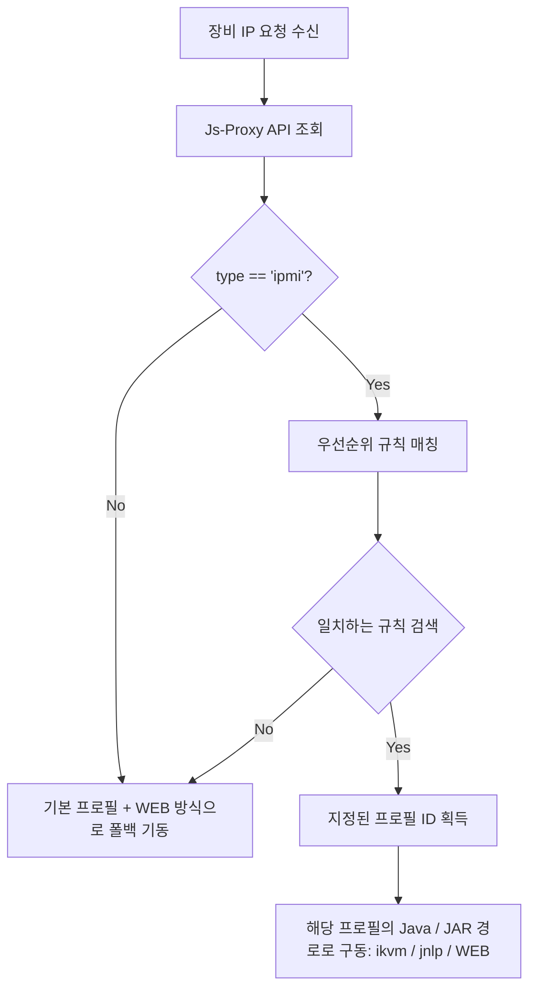

# 🛠️ Go 데몬 프로필 기반 스마트 라우터 설계 사양서

본 문서는 **IPMI Manager Go 데몬**의 포트 변경(`4447`), 단일 IP 기반 스마트 라우팅 판단 흐름, 다중 실행 프로필(Profile) 관리 모델, 로컬 환경 실시간 진단 및 외부 연동 API 호출 가이드라인을 정의하는 설계 사양서입니다.

---

## 1. 시스템 사양 요약

*   **대기 포트 (Port)**: `4447` (기존 `8080`에서 변경)
*   **외부 호출 API**: `GET http://127.0.0.1:4447/api/connect?ip=[대상_장비_IP]`
*   **연동 용어 통일**:
    *   **`WEB`**: 크롬 브라우저 기동 및 IPMI 웹 콘솔 자동 로그인 (기본 폴백 방식)
    *   **`ikvm`**: 로컬 Java 환경을 이용한 `iKVM.jar` 직접 실행 방식
    *   **`jnlp`**: `javaws.exe`를 활용한 자바 웹 스타트 실행 방식

---

## 2. 스마트 라우팅 및 프로필(Profile) 아키텍처

로컬에 설치된 다양한 버전의 Java JRE 환경이나 `iKVM.jar` 버전을 유연하게 관리할 수 있도록 **실행 프로필** 개념을 도입합니다.



### ① 실행 프로필 (Profile) 데이터 모델
```json
{
  "profiles": [
    {
      "id": "profile_java8_default",
      "name": "Java 8 (기본값)",
      "java_path": "C:\\Program Files (x86)\\Java\\jre1.8.0_291\\bin\\javaws.exe",
      "ikvm_jar_path": "C:\\Users\\kuri\\MyProJ\\ipmi-manager\\IPMIVIEW\\2.14.0\\extracted\\...\\iKVM.jar",
      "is_default": true,
      "description": "기본 자바 8 및 내장 iKVM 2.14 버전 프로필"
    },
    {
      "id": "profile_java8_legacy",
      "name": "Java 8u161 (구형 장비용)",
      "java_path": "C:\\Program Files (x86)\\Java\\jre1.8.0_161\\bin\\javaws.exe",
      "ikvm_jar_path": "C:\\Users\\kuri\\MyProJ\\ipmi-manager\\IPMIVIEW\\2.14.0\\extracted\\...\\iKVM.jar",
      "is_default": false,
      "description": "구형 SSL/TLS 암호화 장비 전용 구버전 자바 프로필"
    }
  ]
}
```

### ② 규칙(Rule) 데이터 모델 확장
각 규칙은 실행 방식 외에 **연동할 프로필 ID**를 함께 가집니다.
```json
{
  "rules": [
    {
      "id": "rule_01",
      "vendor": "supermicro",
      "model_pattern": "x10",
      "connect_type": "ikvm",
      "profile_id": "profile_java8_default",
      "priority": 1,
      "description": "Supermicro X10 장비에 기본 자바 프로필로 iKVM 구동"
    }
  ]
}
```

---

## 3. 로컬 구동 환경 실시간 진단 (Diagnostics)

웹 GUI 화면에서 현재 설정된 프로필 경로상의 실행 파일들이 정상적으로 존재하는지 진단할 수 있도록 백엔드에 `/api/diagnose` API를 제공합니다.

*   **호출**: `GET http://127.0.0.1:4447/api/diagnose?profile_id=[프로필_ID]`
*   **검증 로직**:
    *   지정된 프로필의 `java_path` (`javaws.exe`) 존재 여부 판별.
    *   동일 경로 내 `java.exe` 파일 존재 여부 판별.
    *   `ikvm_jar_path` (`iKVM.jar`) 파일 존재 여부 판별.
*   **UI 표현**: 설정 GUI 화면에 각 프로필별 파일 탐지 여부를 `🟢 감지됨` 또는 `🔴 미감지` 형태로 가시화합니다.

---

## 4. 외부 연동용 호출 가이드 (JavaScript Sample)

외부 웹페이지(예: 자산 관리 대시보드)에서 로컬 사용자의 Go 데몬을 기동시키기 위해 호출하는 JavaScript 코드 예시입니다. 로컬 데몬이 켜져 있지 않거나 에러가 발생한 경우 웹(`WEB`) 콘솔로 자연스럽게 브라우저를 이동시키는 폴백 예외 처리를 포함합니다.

```javascript
/**
 * 로컬 IPMI Manager Go 데몬을 통해 원격 KVM을 구동합니다.
 * @param {string} ip 대상 장비의 IPMI IP 주소
 * @param {string} fallbackUrl 데몬 호출 실패 시 이동할 웹 콘솔 주소 (예: https://10.96.19.35)
 */
function connectToKvm(ip, fallbackUrl) {
    const localDaemonUrl = `http://127.0.0.1:4447/api/connect?ip=${encodeURIComponent(ip)}`;
    
    console.log(`[KVM] 로컬 데몬 호출 시도: ${localDaemonUrl}`);
    
    // 1. 로컬 데몬에 연결 요청 전송 (타임아웃 3초 제한)
    const controller = new AbortController();
    const timeoutId = setTimeout(() => controller.abort(), 3000);

    fetch(localDaemonUrl, { 
        method: 'GET',
        signal: controller.signal
    })
    .then(response => {
        clearTimeout(timeoutId);
        if (!response.ok) {
            throw new Error(`HTTP Error: ${response.status}`);
        }
        return response.json();
    })
    .then(data => {
        if (data.success) {
            console.log(`[KVM] 로컬 앱 구동 성공: ${data.message}`);
            // 성공 알림 처리 (필요시 토스트 메시지 출력)
        } else {
            console.warn(`[KVM] 데몬 판별 실패: ${data.error}. 웹 폴백을 기동합니다.`);
            openFallbackWeb(fallbackUrl);
        }
    })
    .catch(error => {
        clearTimeout(timeoutId);
        console.error('[KVM] 로컬 데몬이 응답하지 않거나 기동되어 있지 않습니다. 웹 브라우저 접속으로 폴백합니다.', error);
        openFallbackWeb(fallbackUrl);
    });
}

function openFallbackWeb(url) {
    // 새 창으로 직접 장비의 IPMI 웹 페이지 오픈
    window.open(url, '_blank');
}
```

---
*마지막 업데이트: 2026-07-01 03:31 (KST)*  
*작성자: [사무실-삼식이]*
