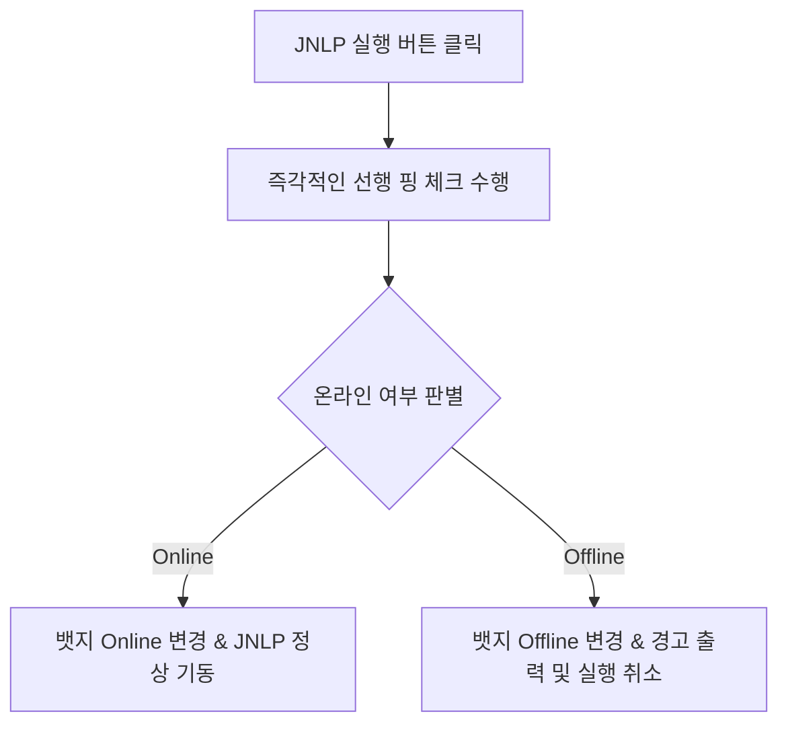

# 📝 장비 IP 핑 체크 기능 (Device IP Ping Checking)

이 문서는 등록된 IPMI/BMC 장비들의 네트워크 온라인 여부를 실시간으로 판별하여 사용자 인터페이스(UI)에 시각적으로 표시해 주는 핑 체크 기능의 동작 방식 및 설계 사양서입니다.

---

## 🔍 배경 및 목적

사용자가 KVM 접속을 시도하기 전에 대상 장비가 켜져 있는지, 네트워크 통신이 가능한 상태인지 미리 파악할 수 있도록 돕기 위해 구현되었습니다. 
네트워크 상태가 오프라인인 경우 불필요하게 자바 뷰어나 브라우저가 대기하다가 타임아웃 오류를 내는 상황을 미리 방지할 수 있습니다.

---

## 🛠️ 기능 사양

### 1. 백그라운드 동적 업데이트 (동시성 제어)
화면 로딩 및 렌더링 속도에 영향을 주지 않도록 모든 핑 체크는 백그라운드 비동기 루프로 동작합니다.
특히 수많은 장비가 등록되어 있을 때 동시에 많은 `ping.exe` 프로세스가 기동되어 시스템 리소스를 과점하는 문제를 방지하기 위해 **최대 3개씩 순차적으로 실행되는 동시성 제어(Limit Concurrency)**를 탑재하였습니다.

```javascript
// 3개씩 청크 단위로 나누어 순차 처리 (app.js)
const limit = 3;
for (let i = 0; i < badgeArray.length; i += limit) {
  const chunk = badgeArray.slice(i, i + limit);
  await Promise.all(chunk.map(async (badge) => { ... }));
}
```

### 2. JNLP 실행 시 선행 핑 체크 (Pre-launch Verification)
사용자가 `☕ JNLP` 실행 버튼을 누르면, 백그라운드 주기와 상관없이 **해당 장비의 IP에 대해 즉각적인 핑 체크를 우선 수행**합니다.

- **온라인(Online)인 경우**:
  - 화면 상의 뱃지를 즉시 `Online`으로 업데이트하고, 기존의 JNLP 뷰어 실행 로직을 정상 진행합니다.
- **오프라인(Offline)인 경우**:
  - 화면 상의 뱃지를 즉시 `Offline`으로 변경합니다.
  - 사용자에게 `[오프라인] 장비와 통신할 수 없습니다. JNLP 실행을 취소합니다.` 라는 경고 알림창(Alert)을 출력하고 **구동 단계를 즉각 차단(Cancel)**합니다.



### 3. 백엔드 처리 (`main.js`)
Windows 환경의 기본 핑 명령어(`ping`)를 사용하며, 빠른 응답성 확보를 위해 타임아웃 및 시도 횟수를 최소화합니다.
- `-n 1`: 핑 패킷을 1회만 송신합니다.
- `-w 800`: 응답 대기 타임아웃을 800ms로 제한합니다.

```javascript
ipcMain.handle('device:ping', async (_, ip) => {
  return new Promise((resolve) => {
    exec(`ping -n 1 -w 800 ${ip}`, (err, stdout, stderr) => {
      if (err) {
        resolve({ success: false, online: false });
      } else {
        const online = stdout.includes('TTL=') || stdout.includes('ttl=');
        resolve({ success: true, online });
      }
    });
  });
});
```
